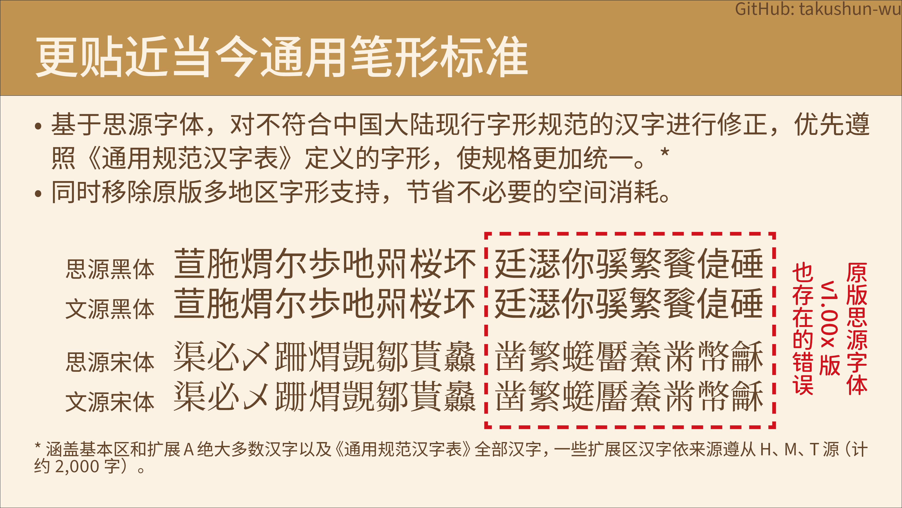

<!-- [Click to read English readme file](./README-en.md) -->

# 文源字体（预览版）
基于思源字体进行二次开发，使之更加适合在简体中文情景下使用以及简体中文TeX排版领域的中文字体，开源免费商用。

## 简介
文源字体包含三大字体系列：文源黑体、文源宋体和文源圆体。这些字体都是基于思源黑体和思源宋体二次开发而来。文源字体支持的大多数汉字（GB 18030-2022实现级别2范围内几乎全部）采用中国大陆字形标准，且非汉字符号迎合简体中文一般使用习惯。以上字体均采用OFL协议，任何个人与团体均可免费商用。

虽然Adobe和Google联合发布的思源黑体和思源宋体对整个东亚的设计和出版领域起了十分重大的影响，同时也开启了基于中日韩文字的开源字体的新局面，但囿于单个字体文件的65,535字形数限制等技术原因，同时还要支持两岸三地、日本、韩国等多个地区的字形显示，因此某个地区版本的字体有时会出现不符合该地区字形标准的现象。

文源字体针对以上弊病，对原版思源字体进行优化，改正了错误汉字字形。为减少不必要的空间消耗，移除了原版思源字体的多地区字形支持。同时还根据实际使用需求，增加了一定数量的扩展区汉字（扩展B~I）。此外还在原版基础上增加了西文字符、拉丁文斜体等功能支持，并在此基础上，新增一个字体家族——文源圆体。

## 功能介绍

## 安装指南
本字体分为标准版OTF（PostScript曲线）、标准版TTF（TrueType曲线）以及缩窄间距版TTF版本。用户可根据实际情况任选其一安装。（**文源圆体现暂无缩窄间距版TTF版本，后续会根据字体本身的更新而更新**）

版本选择建议：
- Windows系统建议选择TTF版本安装，若您经常使用Adobe设计软件，可选择OTF版本（OTF版本字体文件在Microsoft Office中无法嵌入字体，同时其自带的导出PDF功能无法转化成可复制的文字）；
- macOS/iOS/Linux/BSD/Android等（类）Unix系统建议选择OTF版本安装；
- 此外还提供了缩窄间距版TTF版本（字体/压缩包文件名带有“C”的版本）。在Microsoft Word等环境下行间不会出现太多空白（默认情况下，效果与“等线”、“宋体”等字体相仿）。

## 字体授权
本字体以[SIL Open Font License（SIL开源字型授权）](https://openfontlicense.org/open-font-license-official-text/)授权形式发布。**任何个人、企业、团队等对本字体进行使用、复制、修改、分发等任意用途即视为您已完全阅读、充分理解并同意SIL Open Font License授权协议，并保证不作出任何异议，同时您还理解并同意：当您违反SIL Open Font License授权协议任意一条条款时将严格按照SIL Open Font License授权协议的有关规定进行处理，必要时作者可追究您的民事和/或刑事责任。**

[点击阅读SIL Open Font License授权协议（英文版）](LICENSE.md)

[点击阅读SIL Open Font License授权协议（中文翻译版）](LICENSE-zh.md)

[点击阅读SIL Open Font License授权协议的常见问题合集（英文版）](https://openfontlicense.org/ofl-faq/)
### 您可以：
- 任何个人、团体、组织及企业可免费进行商业目的和非商业目的使用，无需支付费用、事先告知作者、标明来源信息或征得作者许可；
- 对字体文件进行二次发布或安装、嵌入到任何软件或设备中，同时软件或设备可被再次分发/销售；
- 对字体文件进行修改、扩充和格式转换，但如果您要发表二次修改的作品，**必须满足如下条件**：
    - **以SIL Open Font License的授权形式**发表，同时**不得使用本字体的保留名称（以及它的其他语言的翻译形式）：WenYuan Gothic、文源黑体、WenYuan Mincho、文源宋体、WenYuan Maru、文源圆体**（若仅对源字体进行格式转换，或子集化，且不将更改后的字体文件单独发布可继续使用该保留名称）；
    - 必须免费配布（包括制作仅以安装本字体为目的之安装包，但不含与其他软件组成嵌合体的形式），且不得在SIL Open Font License授权协议的基础上加入任何额外限制；
    - 完整保留本字体提供的许可证开头的版权声明，不论作了何种形式的修改。
### 您不可以：
- 对字体文件中的任何部分（包括但不限于字形、OpenType特性逻辑）进行倒卖兜售（或其变相付费等类似盈利行为），包括但不限于：将字体文件单独售卖、与其他字体进行捆绑售卖、需付费办理特殊权限才可使用字体等；
- 将字体文件中的任何部分以非SIL Open Font License授权协议发表；
- 本文未列明的，但违反SIL Open Font License授权协议的其他行为；
- 利用本字体文件或其衍生品进行危害计算机系统正常进行的行为（包括但不限于在字体文件中嵌入计算机病毒、主观故意利用程序或系统存在的BUG来扰乱计算机系统的正常运作）；
- 将本字体用作违反当地法律法规的用途。
### 其他声明
- 作者不行使、未能及时行使或未充分行使SIL Open Font License授权协议所享有的合法权利，不应被视为放弃该权利，也不影响作者在将来行使该权利；
- 若SIL Open Font License授权协议存在其中一项或多项条款全部或部分被视为无效或不具有执行力或因不可抗力无法强制执行，并不损害SIL Open Font License授权协议其他条款的执行力；
- **本字体为免费商用字体，凡是需要付费或者使用/办理特殊权限来获得该字体的行为，都是诈骗行为，谨防上当受骗；**
- 本字体不包含任何政治意图、隐喻及目的，与一切政治活动无关。作者不承担用户使用该字体所产生的任何连带法律责任。

## 注意事项
- 尽管作者在制作字体时力图准确和易用性，但因技术、个人能力和精力有限，无法保证字体本身数据的准确性及预期呈现效果在您的设备是否能够完美复现。因此，作者不对本字体作任何明示或暗示的保证，同时作者不承担您使用该字体所产生的任何索赔、损害或可归责事由而来的任何责任，请用户谅解。如果您使用该字体时遇到问题，恳请尽快向作者反馈。

## 其他内容（点击以查看）
**[更新日志（文源宋体）](CHANGELOG-mincho.md)** | **[更新日志（文源黑体）](CHANGELOG-gothic.md)** | **[更新日志（文源圆体）](CHANGELOG-maru.md)**

<!-- **[常见问题](FAQ.md)** -->

**[文源字体支持的扩展字字表（PDF）](doc/extchars.pdf)**

**[相关字体和资源](RELATED.md)**

## 问题反馈与联系方式
如您在使用本字体的过程中如有任何问题和建议，欢迎大家向作者反馈。您既可以在GіtΗub或Gitee中对应项目中提交issue（严禁提交无关内容），也可以通过下列联系方式中进行反馈。

> [!IMPORTANT]
>
> 在进行反馈之前，请先查阅本项目的issue分区，查看是否存在重复。

> [!WARNING]
>
> 下面的GіtΗub链接在跳转前，请确保域名是“**g i t h u b . c o m**”（去掉字符间空格），本人无“重庆开源共创”旗下的GitCode平台账号，**从未主动且从未授权第三方**在GitCode等类似平台上创建存储库。**严禁GitCode等代码托管平台在未经作者本人书面许可的情况下私自搬运本字体项目，否则作者将追究法律责任。**
### 本项目地址
- **【更新首发】GіtΗub：https://github.com/takushun-wu/WenYuanFonts** **（请确保上面的是GіtΗub链接）**
- Gitee：https://gitee.com/takushun/WenYuanFonts
- 百度网盘（仅提供字体文件与扩展字列表，包含历史版本，建议选择最新版本下载）：https://pan.baidu.com/s/1sZQNvQ-k-w5MW_o6ACD0Zw?pwd=1m8h
### 联系方式
- 代码托管平台
    * GіtΗub：https://github.com/takushun-wu/ **（请确保上面的是GіtΗub链接）**
    * Gitee：https://gitee.com/takushun/
- 邮箱
    * takushun-wuⓐoutlook●com
    * junny_2016ⓐqq●com
    * takushunwuⓐgmail●com
- QQ：②❽③❸⑨❹④❻①❸（添加好友请备注“**文源字体问题反馈**”，暂不接受字体定制请求）
#### 若通过下面的联系方式联系，我可能无法及时回复。
- 哔哩哔哩：https://space.bilibili.com/156861970
- 知乎：[点此查看知乎个人主页](https://www.zhihu.com/people/wu-zhuo-jun-78)
- 小红书：[点此查看小红书个人主页](https://www.xiaohongshu.com/user/profile/674b1b38000000001d02ed26)
- 𝕏（推特）：[@TakushunWu](https://x.com/TakushunWu)

## 打赏支持

### 打赏捐助前的注意事项
- 打赏捐助前请务必仔细检查付款账户（支付宝&微信用户名：**takushun**，若有改动会在第一时间更正），我们无法承担您受骗的损失。
- 上述付款账户为**唯一正式**受捐账户。若您发现本页面的账户信息与二维码/链接所提供的付款账户不符，请立刻对其进行举报，必要时可协助相关司法机关。
- 打赏捐助后如愿意，可留言写明您的捐款时间和金额，感谢您的支持。同时，您作为捐助者，有权选择是否在公开页面上写入您的信息（如昵称、个人空间主页等）。
- **打赏捐助款项一经转账，恕不退还，请慎重考虑决定。（未成年人请取得其法定监护人的许可后方可捐助）** 打赏捐助费用的使用解释权归作者本人（takushun）所有，**不接受任何形式的监督**。
